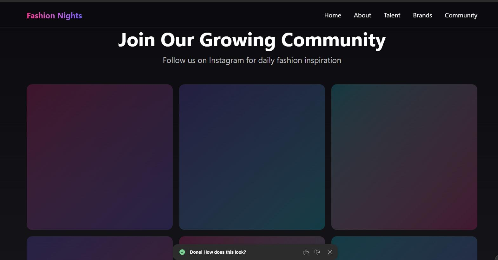

# Fashion Nights — Landing Site

The frontend for [fashionnights.in](https://www.fashionnights.in/), a platform
connecting fashion talent, brands and community members. React + TypeScript, built
with Vite, deployed on Vercel.

<p align="center"></p>

## What's in this repo

This repo is the **frontend only** — three submission forms (Talent, Brands,
Community) that call out to a backend API. That backend (the service behind
`getApiUrl()` in each form) isn't part of this repository.

| Page | Route | What it does |
|---|---|---|
| Home | `/` | hero, galleries, platform overview |
| Talent | `/talent` | talent submission form |
| Brands | `/brands` | brand partnership form |
| Community | `/community` | community signup |
| About | `/about` | platform info |

## Run it locally

```bash
npm install
npm run dev      # http://localhost:5173
npm run build    # production build
```

Those are the only two scripts defined in `package.json` — `preview`,
`type-check` and `lint` aren't set up yet, despite an earlier version of this README
mentioning them.

## Configuration

```env
VITE_API_BASE_URL=
```

`getApiUrl()` in each form page falls back to `http://localhost:5173` in development
and needs `VITE_API_BASE_URL` set to a real backend URL in production — the pages
currently reference `http://localhost:5001` as a health-check placeholder.

> **Note:** `.env.example` also lists `GOOGLE_CLIENT_EMAIL`, `GOOGLE_PRIVATE_KEY`,
> `EMAIL_USER` and `EMAIL_PASS`. Those describe a Sheets-backed CRM + email-notification
> backend that isn't in this repository — they belong to whatever service
> `VITE_API_BASE_URL` points at, not to this frontend. **If any of those ever get set
> with a `VITE_` prefix in this project specifically, don't** — Vite inlines every
> `VITE_`-prefixed variable into the JavaScript shipped to the browser, so a
> `VITE_GOOGLE_PRIVATE_KEY` would ship a private key to every visitor's browser. Keep
> secrets like that on the backend, unprefixed.

## Stack

React 18, TypeScript, Vite, Tailwind CSS, Radix UI, React Router v6, React Hook Form +
Zod, Framer Motion, Sonner for toasts.

## Deploy

```bash
npm i -g vercel
vercel
```

Or connect the repo on [vercel.com](https://vercel.com) — `vercel.json` already sets
the Vite build/output configuration.
